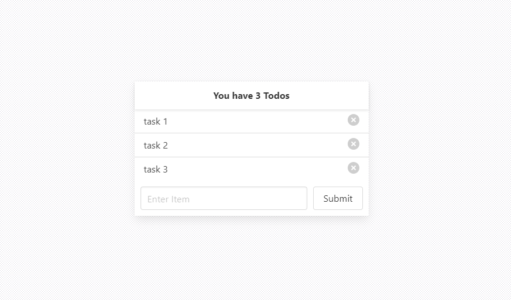

# Todo App

Arkadaşlar bu haftaki ödevinizde api kullanarak bir todo app yapmanız gerekiyor.

## Model

```js
todos {
title: string;
isDone: boolean;
user: string;
}
```

Örnek:

```js
{
title: 'Test 1',
isDone: false,
user: 'github.username'
}
```

## Servis adresi

Herkes aynı servisi kullanacak. Bu yüzden gelen Tek bir servis olacaktır.
Bu yüzden tüm listeyi aldıktan sonra user bazlı bir filtreleme yapmanız gerekmektedir.

_Base URL:_ https://5fa97367c9b4e90016e6a7ec.mockapi.io/api

_Not:_ veri eklerken user bilgisine kendi github kullanıcı adınızla beraber gönderiniz.

## Adresler

- Tüm liste: GET: <https://5fa97367c9b4e90016e6a7ec.mockapi.io/api/todos>
- Yeni oluşturma: POST: <https://5fa97367c9b4e90016e6a7ec.mockapi.io/api/todos>
- Güncelleme: PUT: <https://5fa97367c9b4e90016e6a7ec.mockapi.io/api/todos>
- Silme: DELETE: <https://5fa97367c9b4e90016e6a7ec.mockapi.io/api/todos/:id>

## Beklenilenler

Sayfa limitiniz yoktur. İstediğiniz kadar sayfa yapabilirsiniz.
Beklenilen özellikler;

- Listeleme
- Ekleme
- Güncelleme
- Sileme

# Ekran görüntüsü


